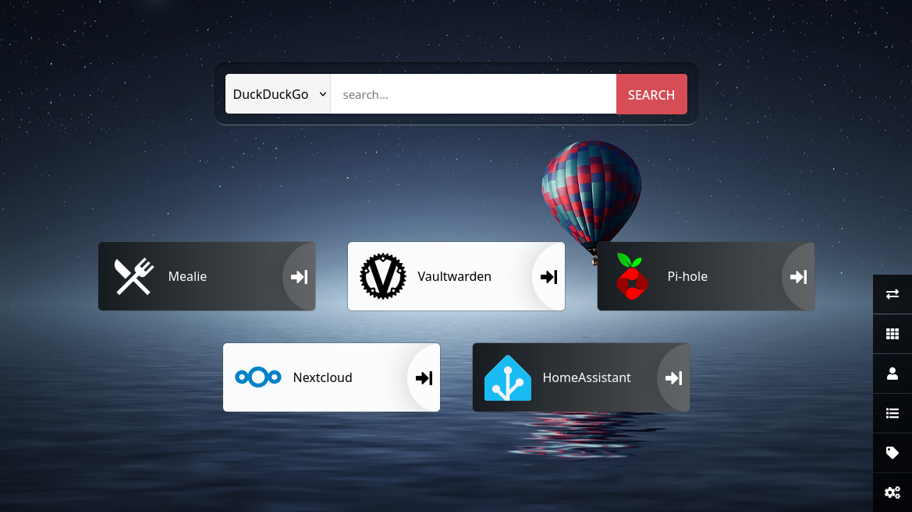

# Home Server
*2026 - Aged 15*

*The dashboard*
## Overview
This started as a small server to block ads on our network, then I gradually added more services. It currently runs Pi-Hole to block ads on our whole network, Mealie for a recipe website to help us decide what to eat, Vaultwarden to keep passwords safe and secure, Nextcloud for document sharing and editing, Heimdall for a dashboard and I am working on Mopidy, Home Assistant and PhotoPrism.
***
## Hardware
I am currently using a Raspberry Pi 4 with a 64GB microSD card to host the server. This works for the services I have so far but apps like PhotoPrism are more demanding so I am considering upgrading. I have made a part list for the PC that I would upgrade to [here](https://uk.pcpartpicker.com/list/RVxgQy){target="_blank" rel="noopener"}. It doesn't yet include a case or any hard drives, but I am looking around, and have found the parts for much less than the advertised prices.
***
## Architecture
The Raspberry Pi runs Debian and hosts the services. I gave it a static IP address with NetworkManager. Docker Compose manages the containerised applications, while Pi-hole provides DNS and DHCP for the network. Each service has its own local domain:

* `mealie.home.arpa`
* `warden.home.arpa`
* Other services use similar local domains.

Heimdall is a dashboard linking to the other services so I don't have to memorise the individual URLs. Most services store their persistent data in bind-mounted directories, allowing containers to be recreated without losing their configuration.
***
## Pi-hole
[Pi-hole](https://pi-hole.net/){target="_blank" rel="noopener"} is a network-wide ad blocker. You use it as your DNS server and any domains that serve ads are not returned. This means many ads are blocked. I first installed this with the install script, but I recently moved to managing it with Docker Compose to make it easier. Unfortunately my router (a Sky one) doesn't allow me to change its DNS server, so in order to make Pi-hole the default for the network I disabled router DHCP and enabled Pi-hole DHCP. I also set up custom domains, one for each other service (e.g. mealie.home.arpa for Mealie, warden.home.arpa for Vaultwarden).
***
## Mealie
[Mealie](https://mealie.io/){target="_blank" rel="noopener"} was the second service I installed. I used Docker Compose to install it. It is a recipe website, where I can add recipes, manage tags, categories, etc. It supports filtering by tags, categories, tools and ingredients used, as well as having a meal planner and shopping list. It was quite simple to set up, I just added about 15 lines to `compose.yml`.
***
## Vaultwarden
[Vaultwarden](https://vaultwarden.com/){target="_blank" rel="noopener"} is one of my most used services. It is a free, open source password manager fully compatible with Bitwarden. It was quite easy to set up (Docker Compose is really useful!) and it stores most of my passwords and other login information. It doesn't have its own client apps, but you can just use the Bitwarden browser extension and mobile app and it works fine.
***
## Nextcloud
I don't use [Nextcloud](https://nextcloud.com/){target="_blank" rel="noopener"} much right now, mostly because it doesn't run very well on my current hardware, but I still have it for when I need it. When combined with extensions, it is basically a Microsoft 365 replacement, with file storage, document editing, document sharing and similar features. I installed this a little differently to the rest, because I had to install a collection of libraries, unzip an archive in DocumentRoot and point `nginx` to it.
***
## Mopidy
[Mopidy](https://mopidy.com/){target="_blank" rel="noopener"} is a music server. It was designed for a single device, but I am going to use a piece of software called Snapcast to broadcast the music to other devices. Mopidy will find the music from local files, Spotify, TuneIn, etc. and Iris will provide the interface so I can decide what to play. Snapcast will then take the music and send it in frames to clients around the house so I can have fully synchronised music everywhere. Mopidy has no official Docker image, so I installed it with `apt` and most of the extensions with `pip3`. Snapcast also doesn't have an official Docker image so I will have to download the .deb file and manually install it.
***
## Home Assistant
[Home Assistant](https://www.home-assistant.io/){target="_blank" rel="noopener"} is a smart home manager. I installed it to see if we had anything that could be controlled but we don't, so I have temporarily disabled it.
***
## Heimdall
[Heimdall](https://heimdall.site/){target="_blank" rel="noopener"} is a simple dashboard. I installed it with Docker Compose again and it is my default site. It has links to the other services I have, and is easy to configure.
***
## Tailscale
To access the server from outside my LAN (e.g. to get passwords on my phone) I use a service called [Tailscale](https://tailscale.com/){target="_blank" rel="noopener"}. I created an account, then installed the app on the server and my phone. I signed in with the same account on both devices and it acted as a VPN, giving each device a Tailnet IP address so I could access one from the other. I then configured the server to be the DNS server for the Tailnet, as well as being a subnet router so I could use its LAN IP address. This meant I could access the services from anywhere in the world without port forwarding.
***
## Docker compose
I use Docker because it keeps the data in one place and I have more control over starting, stopping, updating and recreating the containers. Every week or so I run `docker compose pull` to check for updates, and if there are any I restart the updated containers.
<details>
<summary style="cursor: pointer">Show/Hide Full `compose.yml`</summary>
```yaml
services:

  mealie:
    image: ghcr.io/mealie-recipes/mealie:latest
    container_name: mealie
    ports:
      - "9927:9000"
    volumes:
      - ./mealie-data:/app/data
    environment:
      - ALLOW_SIGNUP=true
      - PUID=1001
      - PGID=1001
      - TZ=Europe/London
      - MAX_WORKERS=1
      - WEB_CONCURRENCY=1
      - BASE_URL=http://mealie.home.arpa
    restart: always

  heimdall:
    image: linuxserver/heimdall:latest
    container_name: heimdall
    ports:
      - 9999:80
    environment:
      - TZ=Europe/London
    volumes:
      - ./heimdall-data:/config
    restart: always

  bitwarden:
    image: vaultwarden/server:latest
    container_name: bitwarden
    restart: unless-stopped
    volumes:
      - ./bw-data:/data
    ports:
      - "127.0.0.1:8080:80"
      - "127.0.0.1:3012:3012"

#  homeassistant:
#    container_name: homeassistant
#    image: "ghcr.io/home-assistant/home-assistant:stable"
#    volumes:
#      - ./ha-data:/config
#      - /etc/localtime:/etc/localtime:ro
#      - /run/dbus:/run/dbus:ro
#    restart: unless-stopped
#    privileged: true
#    network_mode: host
#    environment:
#      TZ: Europe/London

  pihole:
    container_name: pihole
    image: pihole/pihole:latest
    network_mode: host
    environment:
      TZ: 'Europe/London'
    volumes:
      - ./pihole-data:/etc/pihole
    cap_add:
      # See https://docs.pi-hole.net/docker/configuration/#note-on-capabilities
      # Required if you are using Pi-hole as your DHCP server, else not needed
      - NET_ADMIN
      # Optional, if Pi-hole should get some more processing time
      - SYS_NICE
    restart: unless-stopped
```
</details>
***
## Challenges
* Disabling router DHCP because it wouldn't let me change its DNS server
* Running multiple services on limited hardware
* Deciding which services should run in containers rather than bare metal (directly on the OS)
* Configuring DNS, DHCP and static IP addressing so the services worked together
***
## What I Learnt
* How to use Docker and Docker Compose
* How DNS and DHCP work
* How to manage sites and reverse proxies with Nginx
* How to self-host applications
* How to configure and maintain a Linux server