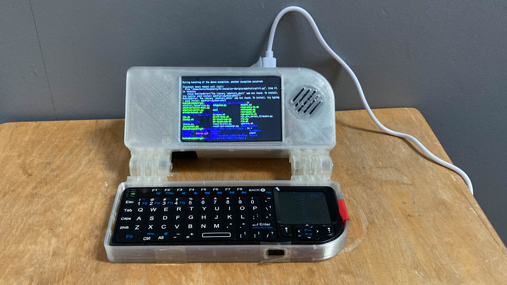

# Laptop
*2023-2025 - Aged 12-14*

## Overview
I made this fully working miniature laptop from scratch. It uses a Raspberry Pi 4, a PiTFT touchscreen display, a miniature keyboard and a 3D printed case. It also has a rechargeable battery, but I haven't added an on/off switch yet so it needs to be plugged in. So far, it only boots to CLI but I am confident I can get it working to desktop.
***
## Electronics
The battery is wrapped in duct tape to stop any possible shorts, then put in between the Pi and the screen. The screen is mounted directly on the Pi's GPIO pins, and has a small breakout of some of the pins. However, I had to bend these so the battery fit in. I am using a PowerBoost 1000C to connect the battery to the computer. The battery's power and ground lines are soldered onto the powerboost. Another pair of wires goes from the powerboost to some of the pins on the PiTFT to power it and the Pi. I also have a small speaker soldered to an amp, but don't yet have the amp's power or data lines connected and I need to add the power switch so I can turn it on and off. The keyboard is just a [Rii mini wireless keyboard](https://thepihut.com/products/miniature-wireless-usb-keyboard-with-touchpad-1){target="_blank" rel="noopener"}. All I had to do was plug the dongle into the Pi and it worked.
***
## Software
The Raspberry Pi has the standard Raspberry Pi OS installed. I have tried to install the display drivers and they half work. It does display to the screen and is the right way up, but it only shows the console. When I use framebuffer tools such as `fbi` and `pygame`, it displays to the screen, so I can make keyboard-based Pygame games. However, as there is no X server running the mouse doesn't work. When I have another display hooked up to the HDMI ports, then it and the PiTFT have the exact same output until I run `startx`, then the PiTFT freezes, and only the HDMI display works until I end the X session.
***
## Case
The case is 3D printed, and I found all the parts online [here](https://www.thingiverse.com/thing:864547){target="_blank" rel="noopener"}. I didn't have to do any CAD. However, because of the resolution of my printer, the screw threads didn't print properly, so I am holding the back on with tape. Also, the Pi can't be screwed into the holes so I have to design and print something to keep it from falling out.
***
## Challenges
There were a number of challenges in making this project, some of which I haven't solved yet. The first one was that I used a PowerBoost 1000 instead of a PowerBoost 1000C, so I had no Micro USB charging port. I didn't even realise this until quite a long way into the project, when I tried to charge the battery and found I couldn't. I had to buy a new one, desolder/cut off wires from the old one and resolder the new one. The next (current) challenge is figuring out how to mirror the HDMI output to `/dev/fb1` which is the screen's framebuffer.