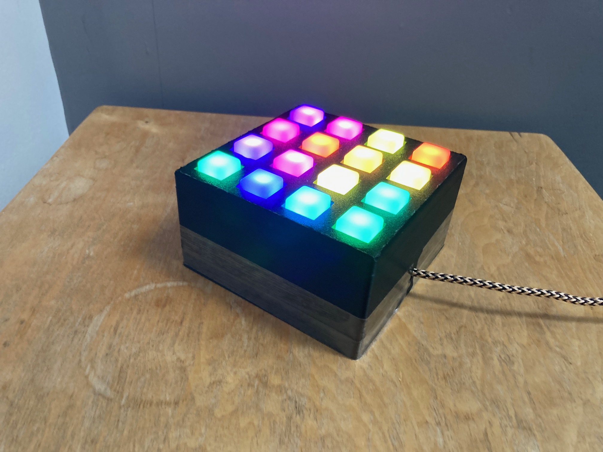

# Light Fantastic
*2023-2025*

## Overview
The Light Fantastic is a project from the book [Raspberry Pi Projects for Dummies](https://www.dummies.com/book/technology/computers/hardware/raspberry-pi/raspberry-pi-projects-for-dummies-281598/){target="_blank" rel="noopener"}. It is a 4x4 RGB illuminated button matrix, so 16 individually addressable RGB lights under 16 buttons. In the book, they run a ribbon cable to a raspberry pi outside the box, but as the Pico has now been released, I am using that inside the box. It is now mostly working, but there are still 2 buttons that don't register presses.
## How Was It Built?
1. I took a pre-made PCB and altered it
2. I soldered a bunch of LEDs and diodes
3. I attached wires around the different ports
4. I attached the wires to the Raspberry Pi Pico
5. I programmed it
6. I put it in a case
## PCB Altering
First of all, I took the [Sparkfun button pad pcb](https://www.sparkfun.com/button-pad-4x4-breakout-pcb.html)(target="_blank" rel="noopener"). This was designed for this sort of project. However, I was going to use Neopixels, not standard RGB LEDs, so it needed some modification. I cut a whole load of traces on the board to prevent short-circuits. I also accidentally cut a trace that I wasn't supposed to so I had to solder a wire across it.
## LEDs and Diodes
This project needed 16 WS2812B LEDs for the illumination and 16 diodes to prevent crashing and possible damage when 2 or more buttons are pressed at once. I soldered the diodes first, but not very well as it was one of my first times soldering it. I then did the LEDs, which was a bit better because I had got more experience in my break for a few months. They weren't much better, though, as the pins were much closer together so were much harder to do.
## Wiring it Up
The first wires I did were the Din wire, through a resistor, to the first LED. I then did the Dout of the last LED of each row to the Din of the first LED on the next row. Next, I did the power and ground rails for the LEDs. I was then able to test them. I found that 2 of the Neopixels were just broken so we had to get some more, but after that it worked! I then had to do the 8 wires for the button matrix which went quite well.
## Pico Connection
I didn't really feel confident soldering wires straight to the Pico, and I also might want to remove it and use it for something else later. My solution to this was to buy some 2.54mm pitch screw terminals and solder only the pins I needed. This worked really well and when I attached the wires to them they just worked.
## Programming
I am programming in CircuitPython as I don't want to download a new firmware file for every update to the code. I made a main library that handles the actual interfacing with the board. It reveals functions to set LEDs to values based on either their index or xy coordinates, clear the LEDs, write changes, get buttons pressed, wait for a button to be pressed and get multiple button presses. I can then use that to make games for it. So far, I have only made a Lights Out game, where you have to turn all of the LEDs off. When you push a button, it inverts it and the 4 buttons it's touching. There are multiple levels, each one requiring more and more presses to win.
## Case
It was quite fragile outside of a case, so I designed a case in TinkerCAD and 3D printed it. I made it in two parts so I could put the electronics inside, but I didn't think how to close it. Currently, the two parts are held together by tape.
## Progression
This was one of the main defining projects for me, as it taught me a lot. When I started, I didn't really know how to solder or how electronics worked, and I could only program in simple Python. Now, I can solder quite well, have a deep understanding of how electric devices work, and I can program microcontrollers to do what I want.
## Challenges
I did come across multiple challenges when making this. The first main one was when I cut the wrong PCB trace and had to solder a wire across it. Then the pins of the LEDs were too close for me to solder at that skill level, so I had to do other things for a long time before I was able to do it. I then had trouble working out how to attach the wires to the Pico, which I only answered in early 2025. Finally, in addition to games, I wanted it to be used as a sort of macro keyboard. This is why I used CircuitPython. When it turned on, it would try to connect to the computer to register itself as a keyboard. However, this mean it would crash when it isn't connected to a computer, for example if I just wanted to play a game on it. I couldn't debug this as it only crashed when it is *not* connected to a serial port.