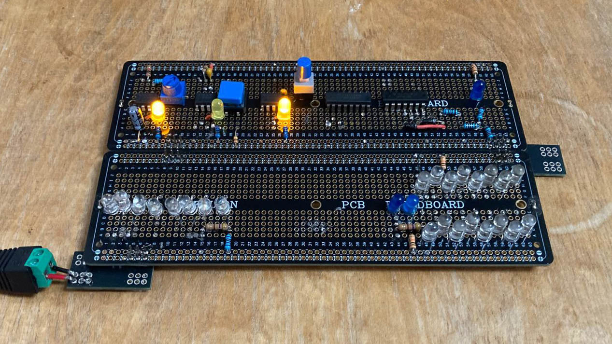

# CPU

This is my current project, it is an 8-bit CPU built out of individual ICs (Integrated Circuits). I got the idea in my Computer Science lessons at school, where I learnt how a CPU works and realised that it isn't actually as complex as I thought. I then started to make parts of it to test in Minecraft, before finding [Ben Eater's similar project](https://www.youtube.com/playlist?list=PLowKtXNTBypGqImE405J2565dvjafglHU) and using that as a guide to making the basic parts of the computer.
## Specs
* 6 - 48 Hz variable clock speed
* 1 core
* 64kB RAM
* 16 registers; r0 is a zero register
* 8-bit maths
* Von Neumann architecture
## My Aim
I want to make an 8-bit CPU with 16 instructions. It will be fully Turing-complete. It will be able to do maths, store data, jump and branch to other parts of a program, and input and output to other devices. The instruction set I want to implement are adding, subtracting, NORing, right shifting, loading from RAM, storing to RAM, loading from a port, storing to a port, loading immediate values, adding immediate values, jumping around the program, branching to other parts of a program depending on a condition, and halting.
## How I'm Building It
I am making it module by module, first breadboarding it to test it and make sure it works, then soldering it down to a [solderable breadboard](https://www.amazon.co.uk/Prototype-Solderable-Breadboard-Electronics-Gold-Plated-2-Matte-Black/dp/B082KY5Y5Z?th=1). So far, I have fully tested the clock module and have mostly soldered it down. I have also tested most of the ALU but had to stop because I ran out of wires! I am soldering the components to the top of the board so you can see them easily and the wires to the bottom of the board, just because I think it looks neater.

## Challenges
I am learning a lot about the internal mechanisms of how computers actually work at the most detailed level, as well as soldering skills, PCB design, and electronic principles such as why pull-up/down resistors are actually necessary.