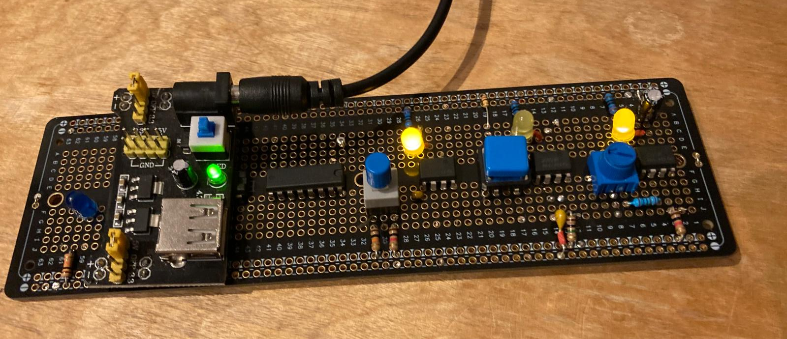

# CPU Clock
*2025 - Aged 14*

*An image of my CPU clock*
## Overview
In a CPU, it needs something to tell it when to do things. This is the clock. Most computers run at a speed of around *3GHz* (3 *billion* cycles per second). Mine will run at up to 48Hz. The clock is made of 4 parts: the automatic clock, the manual clock, the mode selector and the clock logic. The automatic clock just turns on and off again at a variable speed, set by a potentiometer (a dial). The manual clock pulses whenever you push a button, mainly for debugging and testing. The mode selector lets you pick which mode to use and the clock logic actually does the switching.
***
## The Automatic Clock
This was the simplest bit, as it was just a 555 timer in astable mode. I used a potentiometer between pins 6 & 7 so I could change the speed. The rest of the connections were quite straightforward.
***
## The Manual Clock
This was far more difficult than I had anticipated, as buttons often bounce, triggering multiple pulses when you only wanted one. I had to use a 555 timer in monostable mode, so when you push the button, it turns on and 0.3 seconds after you release the button, it turns off. This means that if the button does bounce, the extra pulses will be caught in the 0.3 seconds before it turns off.
***
## The Mode Selector
Both this and the clock logic could be replaced by a simple 3-pin switch, but again you get the problem of button bounce. Instead, I had to use a 555 timer in bistable mode, where you can push a button once and turn it on, and push the button again and turn it off. This was the hardest part, and I took a while to get it working. After a while, I found that you should add a 100nF capacitor between pin 5 & ground, so I did and it worked.
***
## The Clock Logic
Now that I have 3 signals (automatic clock, manual clock and mode), I had to make a circuit to switch between auto and manual modes. This wasn't too hard. First, I had to invert the mode so I had a mode signal and a not mode signal. I then ANDed the auto clock signal with the not mode signal, and the manual clock with the mode signal. I then ORed the two outputs together with a homemade diode OR gate. This was my first problem, as it either gave a high output or a floating output, which was registered as high by the next gate. I fixed it by adding some pull-down resistors. Finally, the output of that gets ANDed with the inverted halt signal to get the output.
***
## Challenges
When testing the clock module, the circuit that should have made the bistable 555 timer didn't work, so I had to experiment with a lot of different methods. I eventually got it working by tying a 0.1µF capacitor across pin 5 and ground, but weirdly when I soldered it down, it worked without the capacitor. I still added it in just in case. In addition, I had a problem with floating outputs of the diode OR gate, but I fixed it with a pull-down resistor. However, sometimes now when it is on the automatic clock, it just stays off. I think I just need to reduce the strength of the resistors, but I haven't done this yet.