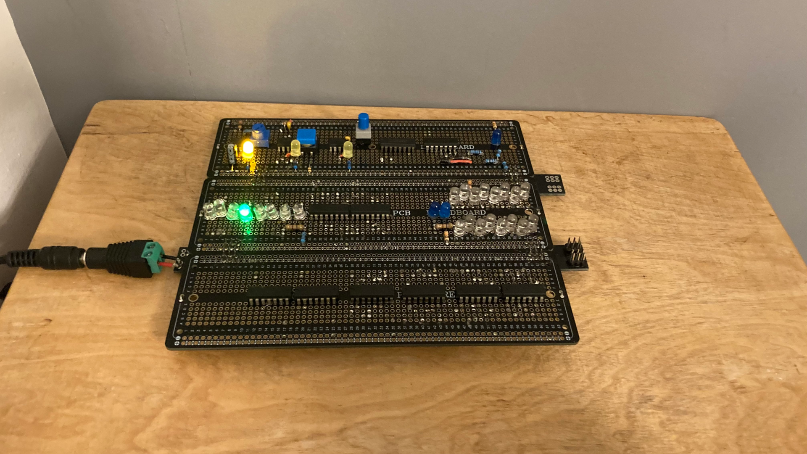

# CPU
*2025 - Aged 14*

*An image of my CPU so far*
## Overview
This is my current project, it is an 8-bit CPU built out of individual ICs (Integrated Circuits). I got the idea in my Computer Science lessons at school, where I learnt how a CPU works and realised that it isn't actually as complex as I thought. I then started to make parts of it to test in Minecraft, before finding [Ben Eater's similar project](https://www.youtube.com/playlist?list=PLowKtXNTBypGqImE405J2565dvjafglHU){target="_blank" rel="noopener"} and using that as a guide to making the basic parts of the computer.
***
## Specs
* 6 - 48 Hz variable clock speed
* 1 core
* 64kB RAM
* 16 registers; r0 is a zero register
* 8-bit maths
* Von Neumann architecture
***
## My Aim
I want to make an 8-bit CPU with 16 instructions. It will be fully Turing-complete. It will be able to do maths, store data, jump and branch to other parts of a program, and input and output to other devices. The instruction set I want to implement are adding, subtracting, NORing, right shifting, loading from RAM, storing to RAM, loading from a port, storing to a port, loading immediate values, adding immediate values, jumping around the program, branching to other parts of a program depending on a condition, and halting.
***
## ISA
I have made an ISA (Instruction Set Architecture) for my CPU. It shows all of the instructions that my CPU will be able to run, how to use them, what they do and what they compile to.

| Opcode | Usage        | Description                 | Binary              |
|--------|--------------|-----------------------------|---------------------|
| ADD    | ADD rX rY rZ | rX + rY -> rZ               | 0000 XXXX YYYY ZZZZ |
| SUB    | SUB rX rY rZ | rX - rY -> rZ               | 0001 XXXX YYYY ZZZZ |
| NOR    | NOR rX rY rZ | rX with rY -> rZ            | 0010 XXXX YYYY ZZZZ |
| RSH    | RSH rX    rZ | right shift rX -> rZ        | 0011 XXXX 0000 ZZZZ |
| LDR    | LDR rX rZ    | contents of ram at rX -> rZ | 0100 XXXX 0000 ZZZZ |
| STR    | STR rX rZ    | contents of rZ -> ram at rX | 0101 XXXX ZZZZ 0000 |
| SMB    | SMB rX       | rX -> MBR                   | 0110 XXXX 0000 0000 |
| INP    | INP pX rZ    | pX -> rZ                    | 0111 XXXX 0000 ZZZZ |
| OUT    | OUT pX rZ    | rZ -> pX                    | 1000 XXXX ZZZZ 0000 |
| JMP    | JMP x        | PC + X -> PC                | 1001 00 XXXXXXXXXX  |
| BRA    | BRA c X      | if (c) then PC + X -> PC    | 1010 cc XXXXXXXXXX  |
| ???    |              | undecided                   | 1011                |
| ???    |              | undecided                   | 1100                |
| ADI    | ADI rX Y     | add Y to rX                 | 1101 XXXX YYYYYYYY  |
| LDI    | LDI rX Y     | Y -> rX                     | 1110 XXXX YYYYYYYY  |
| HLT    | HLT          | halt                        | 1111 0000 0000 0000 |

I also have some pseudo-instructions that the CPU itself cannot execute, but the assembler (the program that turns these commands into binary) will change into commands that can be executed.

| Opcode | Usage        | Description                 | Resolves to  |
|--------|--------------|-----------------------------|--------------|
| NOP    | NOP          | do nothing                  | ADD r0 r0 r0 |
| CMP    | CMP rX rY    | compare and set flags       | SUB rX rY r0 |
| MOV    | MOV rX rZ    | copy rX to rZ               | ADD rX r0 rZ |
| CLR    | CLR rX       | clear rX                    | ADD r0 r0 rX |
| INC    | INC rX       | increment rX                | ADI rX 1     |
| DEC    | DEC rX       | decrement rX                | ADI rX -1    |
| NOT    | NOT rX rZ    | invert rX -> rZ             | NOR rX rX rZ |
| LSH    | LSH rX rZ    | left shift rX -> rZ         | ADD rX rX rZ |

***
## How I'm Building It
I am making it module by module, first breadboarding it to test it and make sure it works, then soldering it down to a [solderable breadboard](https://www.amazon.co.uk/Prototype-Solderable-Breadboard-Electronics-Gold-Plated-2-Matte-Black/dp/B082KY5Y5Z?th=1){target="_blank" rel="noopener"}. So far, I have completed the clock module, and mostly done the ALU. I am soldering the components to the top of the board so you can see them easily and the wires to the bottom of the board, just because I think it looks neater.
***

*The back of my CPU clock with all the wires*
## What I'm Learning
I am learning LOADS about the internal mechanisms of how computers actually work at the most detailed level, as well as soldering skills, PCB design, and electronic principles such as why pull-up/down resistors are actually necessary.
***
## More Details
* [Clock Module](clock.md)
* [ALU](alu.md)