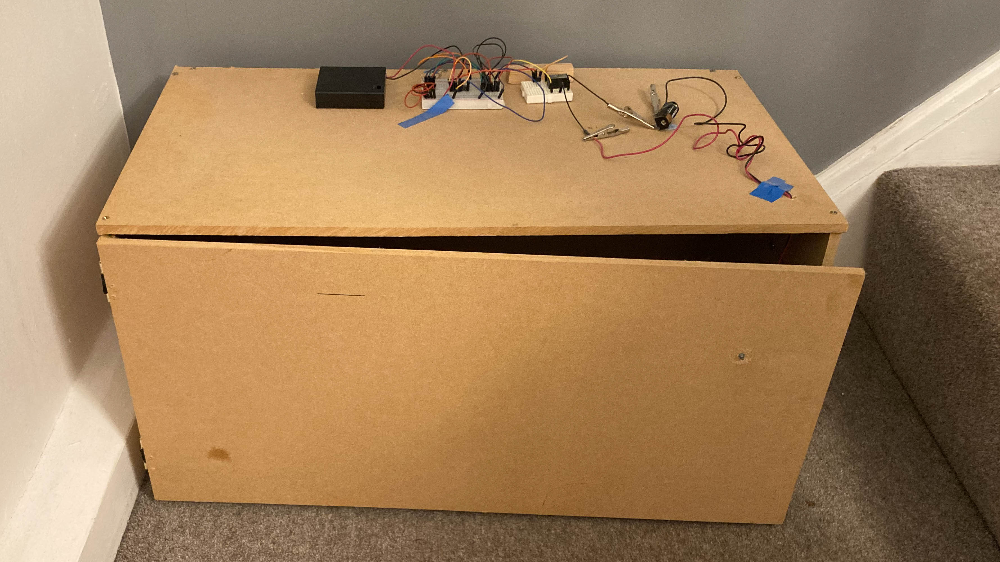

# Safe
*2021 - Aged 10*

*My finished safe*
## Overview
This is my first large electronics project. It isn't very complex by the standards of my other projects but it is on here because I had basically never done this sort of thing before. It is a homemade safe with a 4-bit code to unlock the electromagnet. I sawed the MDF sheets and screwed them together, before adding an electromagnet inside and some metal washers on the door. On top are the electronics, which consist of a 4.5V battery pack, a DIP (Dual Inline Package) switch, 4 AND gates, 6 NOT gates, a transistor, a relay and a 12V battery.
***

*A schematic diagram of how the electronics work*
## My Aim
I wanted to make a safe with a door that locked, and you could only open it if you know the code. I mostly achieved that goal, as there is some resistance to the door when it is locked, but none when unlocked. However, it isn't a very safe safe as the electromagnet isn't very strong so you can just pull the door open, or you could just unplug the batteries.
***
## How it works
1. There are 4 switches, each of which is on or off,
2. The 1st, 3rd and 4th switches are inverted,
3. The outputs of the inverters and the 2nd switch are ANDed together. 
   This means that the output of this is only on if the 1st input is off, the 2nd input is on, and the 3rd and 4th inputs are off.
4. The output of this switches a transistor to increase current,
5. The output of the transistor switches a relay to increase voltage,
6. The relay switches the electromagnet,
7. The electromagnet pulls of washers glued to the inside of the door to close it
***
## Challenges
It was my first large DIY project so I had to learn to use a saw and a drill safely, as well as the electronics. The main problem I had with the electronics was that I had forgotten pull-down resistors, so the inputs were floating (no definite value) when the switches were off. I eventually Googled the problem and put the resistors in and it worked, but I didn't realise why until I started making my [CPU](cpu.md).
***
## What I would change
If I built it again now, I would change a few things:

* I would use a solenoid pushing into a hole instead of an electromagnet.
* I would use a PCB to stop people unplugging wires.
* I would place all of the electronics inside the safe, with only the switches on top.
* I would use more switches, e.g. a 10-bit code