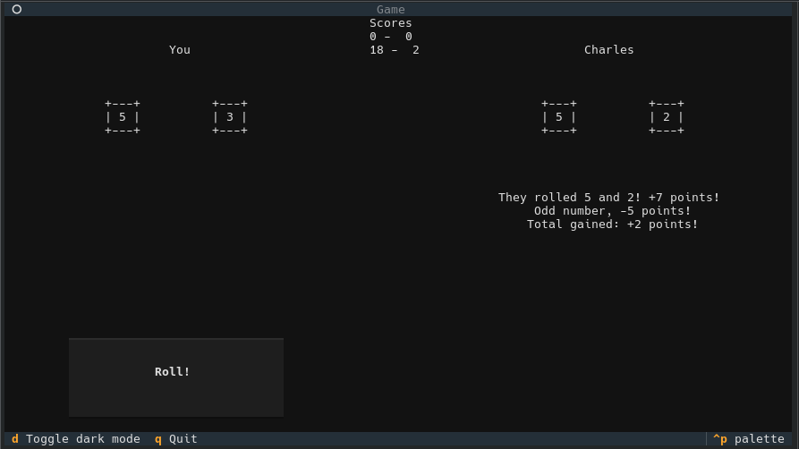

# 20 Hour Project
*2026 - Aged 15*

*Partway through a game*
## Overview
For OCR GCSE computer science, everyone has to complete a project. There were 6 different briefs which I could pick from, then I had 20 hours in lessons to plan, program, test and complete the app. I chose a relatively simple brief, so that I could then put the vast majority of the time into extras that would be more interesting. I turned the simple game into a more complex online multiplayer game that was as secure as I could make it.
***
## Brief
Katarina is developing a two-player dice game. The players roll two 6-sided dice each and get points depending on what they roll. There are 5 rounds in a game. In each round, each player rolls the two dice. The rules are:  

* The points rolled on each player’s dice are added to their score.
* If the total is an even number, an additional 10 points are added to their score.
* If the total is an odd number, 5 points are subtracted from their score.
* If they roll a double, they get to roll one extra die and get the number of points rolled added to their score.
* The score of a player cannot go below 0 at any point.
* The person with the highest score at the end of the 5 rounds wins.
* If both players have the same score at the end of the 5 rounds, they each roll 1 die and whoever gets the highest score wins (this repeats until someone wins).

Only authorised players can play the game. Where appropriate, input from the user should be validated.

Design, develop, test and evaluate a program that:  

1. Allows two players to enter their details, which are then authenticated to ensure that they are authorised players.
2. Allows each player to roll two 6-sided dice.
3. Calculates and outputs the points for each round and each player’s total score.
4. Allows the players to play 5 rounds.
5. If both players have the same score after 5 rounds, allows each player to roll 1 die each until someone wins.
6. Outputs who has won at the end of the 5 rounds.
7. Stores the winner’s score, and their name, in an external file.
8. Displays the score and player name of the top 5 winning scores from the external file.

***
## My Plan
I quickly decided to turn this into an online multiplayer game, instead of just 1 computer. This meant that I needed a client-server model, with 1 server that ran all the games and multiple clients, 1 for each player. In order to make this secure, I used TLS to encrypt the data between server and client. The brief also stated that the users were authenticated, which I spent a while securing. I used an encrypted server-side database to store usernames, and I stored the encrypted password hash instead of the password itself so that even if someone got an unencrypted dump of the DB they still wouldn't be able to log in with someone else's account. All of the game logic, such as dice rolls, were done server-side so that a modded client couldn't say "I rolled a 6 every time" and then win. No private information was in the code, because Python is an interpreted language so anyone could read the code.
***
## TLS
I used TLS to ensure that no-one could sniff packets between the server and the clients. This meant that you couldn't capture packets and use those to find people's login information. This was done with the Python `ssl` module, and the actual transport handled by `socket`, meaning I could use my own protocol instead of using standard HTTP. The certificate I used was generated by `openssl` and was self-signed because I was using IP addresses and `.local` hostnames for testing and Let's Encrypt doesn't generate certificates for those.
***
## Login
When the client first requests to login, it sends the username to the server, which then responds with the salt for that account. The salt is a random number stored with the password so that even if multiple accounts have the same password, they all have different hashes. The server also sends a random number (known as a "nonce", short for number only used once) generated at that point, which is incorporated into the hash, so replay attacks (where they just capture the encrypted packets sent by a client and send them again to login as that user) are much more difficult to achieve. The client then takes the password from the user and hashes it with the [Argon2id](https://en.wikipedia.org/wiki/Argon2){rel="noopener" target="_blank"} hash function twice. The first time uses the salt as normal, the second time uses the nonce the server generated as the salt. This incorporates the nonce into the hash so basic replay attacks would fail. The server then takes the password hash out of the database (it is stored as the password hashed with that account's salt) and hashes that with the nonce it generated. Finally, it compares the hash it made and the hash sent by the client and if they match, the client logs in and is added to the queue. If they do not match, the server denies access.
***
## The Database
In order to store the user data, I used a SQLite3 database. This is because it doesn't need a database server and there is an existing Python module for it. I knew I needed to secure this data, so I encrypted it. Unfortunately, the Python module I used - `sqlite3` - didn't support full-DB encryption, so I encrypted each field before it went into the table. I used the AES-GCM encryption algorithm to do this, because it is near impossible to decrypt without the key. The password to encrypt and decrypt the data isn't stored anywhere, as the server asks the admin for the password when it first starts. This means even if someone has access to the database and can read all of the code and files, they still won't be able to decrypt the database, however, if the admin forgets the password then there is no way to get the data back. I decided this was a reasonable tradeoff.
***
## The Game
Once someone logs in, their connection is added to a queue. Another thread is watching this queue, and when there are 2 or more connections in the queue, the first 2 are put in a game. The server tells each client the other's name, then runs the first game round. The client has to tell the server when the user has rolled the dice, at which point the server tells both clients what was rolled and what the scores are. This repeats for 5 rounds, then the server checks for a tie and does the tiebreaker if needed. Finally, the server gives each client the final scores and the high scores - the top 5 players and how many points they have got out of all of the games they've played. Each player's information is updated in the database, which holds their total score, how many games they've won and how many games they've lost. When waiting for the users to roll the dice, the server has a 2 minute timeout so if one player just doesn't do anything, the game will still continue.
***
## The Client
### CLI
The client was quite simple to start with, as it had a simple command line interface. It just printed the scores and used Python `input()` to wait for the user to press Enter to roll the dice. However, I had some extra time at the end so I upgraded it to a TUI (Textual User Interface).
### TUI
I used the [Textual](https://textual.textualize.io/){rel="noopener" target="_blank"} library to achieve this. When the game starts, it prompts you to select a host, with a few options in a radio button set and an Other option where you enter the hostname manually. It then connects, and you enter your username and password and press either Login or Signup. If you press Login, it communicates with the server and logs in, otherwise it asks you for your name and then signs you up and logs you in. There is then a waiting screen while you are in the queue, then it drops you into the main game interface. It shows you your name, your opponent's name, your roll, their roll, the points history of the game, the reason for getting points from a roll, and the roll button. When either player rolls dice, the numbers in the dice squares change rapidly for a few seconds, then slow down until they stop on your roll. When this happens, it shows you how you gained points, with each reason appearing after a second of delay to build tension, then your score is added to the history. The tiebreaker has the same interface, then when showing results it uses a scrolling text effect to build more tension, then the high scores appear one by one.
***
## Challenges
* Running multiple games simultaneously
* Implementing secure authentication
* Completing the project within the time limit
* Designing the client-server protocol
* Keeping the server in control of everything so clients can't cheat
***
## What I Learnt
* How real-world apps are kept secure
* How to use basic SQL commands through Python
* Building TUIs with Textual
* Why hashing, symmetric encryption and asymmetric encryption are used
* How to use threading in Python
***
## What I'd Improve
* I would improve the error reporting in the UI, because it currently just gives the user the Python exception if it fails to connect, or the slightly more friendly server error if it fails to login
* I would try to move to asynchronous networking instead of threading, because it could perform more efficiently when multiple connections are waiting for input
* I would add a mechanism for the server to give its certificate to the client securely (probably needing to use a certificate authority) because currently to connect to your own server you have to manually install the certificate
* I would do more testing as I only tested it manually a few times because I didn't have enough time to write unit or full-stack tests