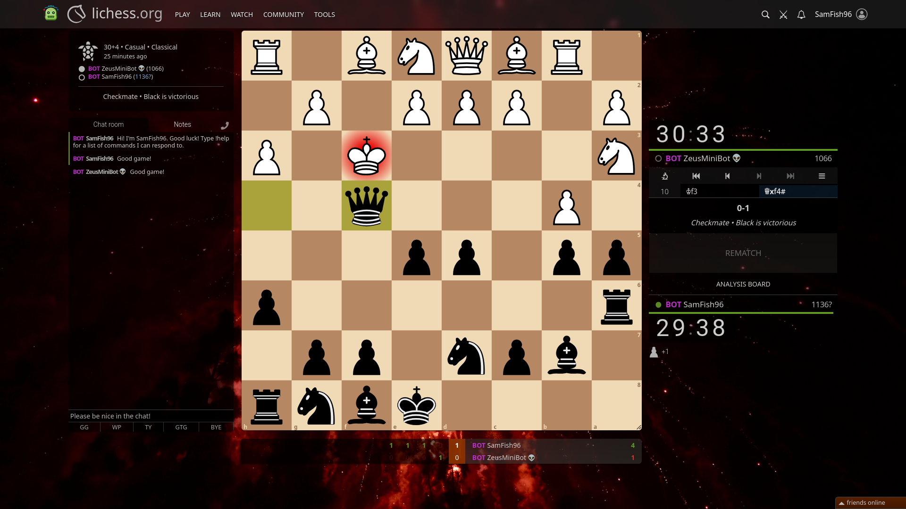

# Chess Bot

*A [Lichess.org](https://lichess.org/h98ou7COBKNf){target="_blank" rel="noopener"} game where my bot won*
## Overview
I created a Java program that can play chess. It generates all legal moves and evaluates them, giving them points. It then plays the highest-ranking move. I have given it a UCI (Universal Chess Interface) frontend so it can interact with other chess apps. For example, I have given it a Lichess account ([SamFish96](https://lichess.org/@/SamFish96){target="_blank" rel="noopener"}) and occasionally it is online.You can see the source code on [GitHub](https://github.com/SamBell2/SamFish/tree/master/src/chess){target="_blank" rel="noopener"}.
## Inspiration
I've been interested in complex decision making programs for a while, and a chess bot was a suitably complex but not overwhelming introduction to them.
## How it works
It uses an 8x8 array of pieces or empty squares to represent the board. Whenever the chess app tells it that a move has been made, it simulates the move on its own board. When it needs to move one of its pieces, it looks at all of the possible moves that it can make, discards any that put it in check, then evaluates all of them. If it has time, it looks at the next turn or two as well. It then picks the move it thinks is best and plays it.
## Key Features
* Generates almost all possible moves.
* Uses [syzygy tablebases](https://syzygy-tables.info/){target="_blank" rel="noopener"} for the endgame to ensure perfect moves.
* Detects checks, checkmates, stalemates and threefold repetition.
* Automatic detailed logging to see the bot's logic.
* Interacts with the Lichess bot API to play online.