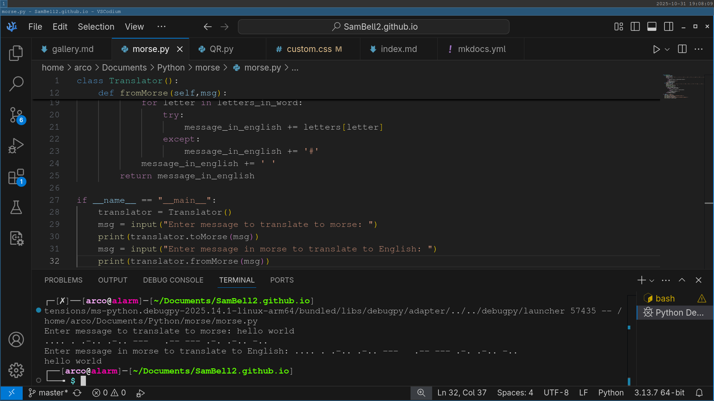

# Morse Code Translator
*2021 - Aged 10*

## Overview
This was one of my first projects, it started just with taking input in English and translating it to morse code. I then expanded it by reversing it, so it could take input as morse code and return English. Next, I learnt the basics of OOP (Object Oriented Programming) and turned it into an object with 2 methods. Looking back, there was no real reason for this other than to experiment with how classes worked. I then used a Raspberry Pi and an LED so I could input English and the light would flash the morse code. Finally, I tried (but failed) to reverse the electronics, so I could point a camera at an LED and it would tell me what it was saying.
***
## The Translator
I defined an enormous Python dictionary relating letters, numbers and symbols to their corresponding morse codes:
```Python
{'a': '.-', 'b': '-...', 'c': '-.-.', 'd': '-..', 'e': '.', 'f': '..-.', 'g': '--.', 'h': '....', 'i': '..', 'j': '.---', 'k': '-.-', 'l': '.-..', 'm': '--', 'n': '-.', 'o': '---', 'p': '.--.', 'q': '--.-', 'r': '.-.', 's': '...', 't': '-', 'u': '..-', 'v': '..-', 'w': '.--', 'x': '-..-', 'y': '-.--', 'z': '--..', '1': '.----', '2': '..---', '3': '...--', '4': '....-', '5': '.....', '6': '-....', '7': '--...', '8': '---..', '9': '----.', '0': '-----', '?': '..--..', '!': '-.-.--', '.': '.-.-.-', ',': '--..--', ' ': ' '}
```
I then looped through the characters in the string to translate, converted them to lowercase, and retrieved the code. If the character wasn't in the map, I used a `#` symbol. I then added the code to a string, followed by a space. Finally, I returned the string. To convert it back into English, I did something similar. I used a reversed version of the dictionary, so it mapped the morse codes to the letter, then I split the morse message into words. I then split each word into characters, retrieved the letter for each morse character, and added a space between each word.
***
## The Object
This was my first attempt at object-orientation, and I didn't use it properly. I just used a class to hold two methods - `toMorse` and `fromMorse` - and that was it. I made a `Translator` class, which I then instantiated, then called the methods on the instance. To be precise, here is the code I had at this stage:
```Python
class Translator():
    def toMorse(self,msg):
        message_in_morse = ''
        letters = {'a':'.-', 'b':'-...', 'c':'-.-.', 'd':'-..', 'e':'.', 'f':'..-.', 'g':'--.', 'h':'....', 'i':'..', 'j':'.---', 'k':'-.-', 'l':'.-..', 'm':'--', 'n':'-.', 'o':'---', 'p':'.--.', 'q':'--.-', 'r':'.-.', 's':'...', 't':'-', 'u':'..-', 'v':'..-', 'w':'.--', 'x':'-..-', 'y':'-.--', 'z':'--..', '1':'.----', '2':'..---', '3':'...--', '4':'....-', '5':'.....', '6':'-....', '7':'--...', '8':'---..', '9':'----.', '0':'-----', '?':'..--..', '!':'-.-.--', '.':'.-.-.-', ',':'--..--', ' ':' '}
        for letter in msg:
            try:
                message_in_morse += letters[letter.lower()]
            except:
                message_in_morse += '#'
            message_in_morse += ' '
        return message_in_morse
    def fromMorse(self,msg):
        letters = {'.-':'a', '-...':'b', '-.-.':'c', '-..':'d', '.':'e', '..-.':'f', '--.':'g', '....':'h', '..':'i', '.---':'j', '-.-':'k', '.-..':'l', '--':'m', '-.':'n', '---':'o', '.--.':'p', '--.-':'q', '.-.':'r', '...':'s', '-':'t', '..-':'u', '...-':'v', '.--':'w', '-..-':'x', '-.--':'y', '--..':'z', '.----':'1', '..---':'2', '...--':'3', '....-':'4', '.....':'5', '-....':'6', '--...':'7', '---..':'8', '----.':'9', '-----':'0', '..--..':'?', '-.-.--':'!', '.-.-.-':'.', '--..--':',', '   ':' ', ';':' '}
        message_in_english = ''
        message_words = msg.split('   ')
        #print(message_words)
        for word in message_words:
            letters_in_word = word.split(' ')
            for letter in letters_in_word:
                try:
                    message_in_english += letters[letter]
                except:
                    message_in_english += '#'
            message_in_english += ' '
        return message_in_english

if __name__ == "__main__":
    translator = Translator()
    msg = input("Enter message to translate to morse: ")
    print(translator.toMorse(msg))
    msg = input("Enter message in morse to translate to English: ")
    print(translator.fromMorse(msg))
```
***
## The Electronics
Unfortunately, I lost the code I had for the lights, but I think I just attached a simple LED to my Raspberry Pi and blinked it. For a dot, it would light up for 0.1 seconds, then turn off again. For a dash, it was 0.5 seconds. The light was off for 0.3 seconds between each dot and dash, and it was off for 1 second between letters. Between words, I think it stayed dark for 2 seconds. I could certainly have sped this up, but I wanted to make a reader and I thought it would be easier to have slower flashes. I never managed to make the reader, because I wanted to use a camera, not a light dependant resistor, so I could make an app for a mobile phone. I asked StackOverflow how to do this (you can see my question [here](https://stackoverflow.com/questions/68589312/can-you-translate-a-flashing-light-into-morse-code){target="_blank" rel="noopener"} - I didn't know how to ask questions well then) and there was an amazing [answer](https://stackoverflow.com/a/68859624/16398595){target="_blank" rel="noopener"} involving calculating frame-by-frame average brightness levels, converting it to a binary signal with a threshold value, retrieving the length of each flash and the time between flashes, classifying them with a threshold, and reconstructing the signal. Sadly, I wasn't good enough at programming back then to understand the idea, but it was a great answer.
***
## Improvements
If I was to do this project again, I would fix a few things:  

* I would remove the object as it adds unnecesary complexity
* I would add 2 versions: one for a Raspberry Pi and one for a normal computer
* The RPi version would have an LED and an LDR to flash and detect flashes:
* The normal version would have a maximised window that changes colour between black and white to flash, and would use the camera to detect flashes
* I would try to make it into a mobile phone app so people can type a message in and point the screen at a friend, who would zoom in on the screen and would recieve the message.