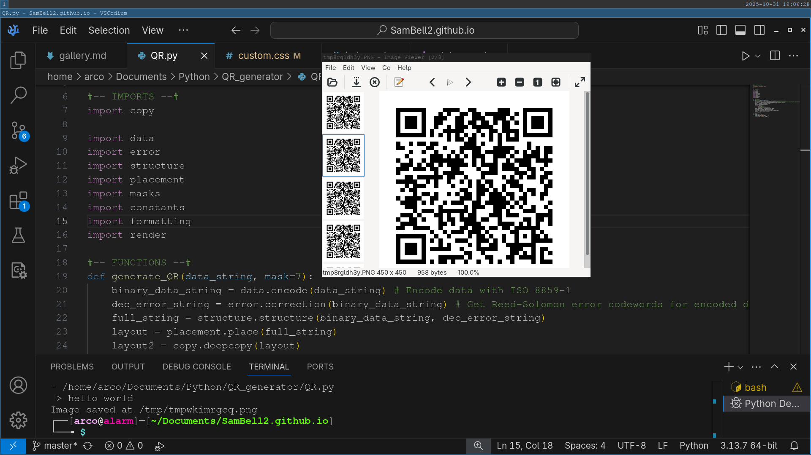

# QR Code Generator
*2024 - Aged 13*

*Part of the code and the ouput of the QR code generator*
## Overview
I got the inspiration for this project because QR codes are everywhere but very few people actually think about how they work. I then found an amazing [guide](https://www.thonky.com/qr-code-tutorial/){target="_blank" rel="noopener"} that showed every step. QR codes are far more complicated than you would think, mostly due to the error-correction. You can imagine that if you scan a QR code in not ideal conditions, then the camera may misread one or two pixels. This means we need error correction, which is really complex! The code is on [my Github](https://github.com/SamBell2/QR_generator){target="_blank" rel="noopener"}.
***
## What It Does
It takes a line of text as input from the user, then generates the QR code, saves it as a temporary file and opens it in your default image viewer. From there you can save it somewhere else or share it.
***
## Technical Summary
It is made of almost 700 lines of Python code split over 9 files. I have used no external modules relating to QR codes, only `pillow` for graphics, `copy` to duplicate it and `tempfile` to save the image. It generates a v5 error level Q alphanumeric QR code, which can hold 87 characters.
***
## Steps
There are multiple steps in making a QR code:  

1. Encode the text in a particular text encoding (ISO 8859-1)
2. Generate error correction codewords
3. Interleave the data and error codewords to make a final binary string
4. Place the individual bits of the binary string in the correct places
5. Apply the mask that makes the QR code easier to read
6. Add constant elements (e.g. the corners)
7. Render
***
## Encoding
This is one of the simplest steps, as all you have to do is connect the mode string (0100 for text) to the length of the string in binary. You then have to convert each character in the text to the ISO 8859-1 standard. This is easier than I thought it was going to be as it is the standard that Python's `chr()` function uses. After that, you just need to fill out the rest of the space with a repeating pattern.
***
## Error Correction
This is by far the hardest part of the QR code. It has quite a lot of maths involved, including polynomial long division in a Galois Field 256. You have to convert the data string to a message polynomial and get a generator polynomial. You then have to divide the message polynomial by the generator polynomial, and the coefficients of the remainder polynomial are the error correction codewords.
***
## Structuring
You have to break the data codewords into blocks, then interleave the first codeword from the first block, followed by the first from the second block and so on. Once you have done the first codeword from each block, you then move onto the second from each block. Once you have done all the data, you then do the same with the error correction codewords. You then need to add a certain number of zeroes to the end so the QR code will be full.
***
## Placement
This is a relatively simple part, although still more complex than you would imagine as there are a number of pixels that you have to avoid. You just start at the bottom-right of the QR code and work your way up in a zig-zag pattern, avoiding all of the reserved areas.
***
## Masks
Occasionally, when you make a QR code, there will be areas of data that look like special symbols such as the corner patterns. This would really confuse the scanner, so you have to apply a mask. These are just lists of which pixels to invert. You have to apply all of them and evaluate which is the best (i.e. has the fewest confusing patterns) then apply that one.
***
## Constants
This is the simplest bit as most of it is pre-set. You have to add the corners, borders, alignment patterns, timing patterns, dark module and the format information areas. The format information needs to be generated but isn't hard. The format string is mostly the same for my codes as I have only one type of QR code. The only bit that changes is the mask pattern used. You then have to error-correct it and add it.
***
## Render
For this, I use Python's `pillow` library to work with images. Each pixel of the QR code is 10 pixels wide in the image so when I open it in an image viewer, it doesn't blur the edges between pixels. I just loop over each pixel in the QR code and place a 10x10 square of whatever colour it is in the image.
***
## Challenges
The hardest bit of this was the error correction, as at the time I didn't even know what a polynomial was or how binary worked. I had to write code to do maths with strings in weird number systems. It took me about a week to make 160 lines of code, and another week to test and debug it!