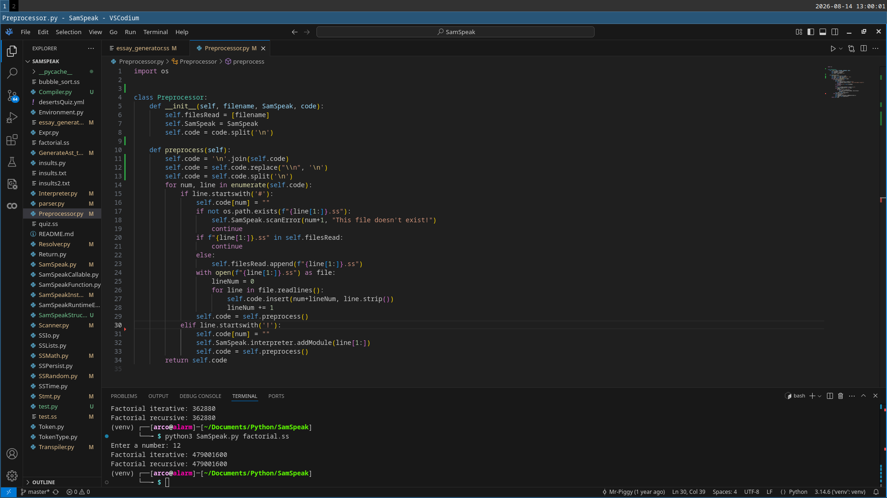

# SamSpeak
*2025 - Aged 14*

*A sample of part of the code*
## Overview
SamSpeak is a programming language and interpreter written in Python. I implemented a lexer, recursive-descent parser, AST, resolver and interpreter, then extended the language with arrays, maps, modules and exception handling. I found and followed a tutorial at [Crafting Interpreters](https://craftinginterpreters.com/contents.html){rel="noopener" target="_blank"}. I mostly followed the tutorial, but I made it in Python instead of Java as I was more comfortable with it. I then changed a large chunk of the syntax  and added more features (such as structures, modules, arrays and maps) so it was *my* language, and I learnt how the sections of the program worked together. The code is on my [GitHub](https://github.com/SamBell2/SamSpeak){rel="noopener" target="_blank"}.
***
## Preprocessor
This was one of the parts that I added that wasn't in the tutorial, and as such it isn't as good. It does three things:  

* Escape characters: It replaces text such as `\n` with an actual newline.
* User modules: Any line starting with `#` is replaced with the contents of the file at the path after the `#`, ignoring if already included or a circular import.
* Builtin modules: Any line starting with `!` is removed and the interpreter includes any functions in the corresponding builtin module.
***
## Lexer
This is the part of the program that takes the raw characters and groups them into tokens. For example, if it finds the string `i = k + 1` it will create this list:  

* IDENTIFIER i
* EQUALS
* IDENTIFIER k
* PLUS
* NUMBER 1  

It is relatively simple, mostly just a loop with a big `if...elif...else` block inside.
***
## Parser
This is the first complicated section, because it turns an array of tokens into an AST - Abstract Syntax Tree - that describes the program flow, conditionals, variables and more. It represents what the entire program is meant to do in a simple structure. I used a recursive descent parser, which is a collection of functions that call each other in order. The first one is `declaration` which looks for a variable, structure or function declaration. If it finds one, it produces the corresponding node in the tree to represent declaring that item. If it doesn't find one, it calls `statement` which does a similar thing but for conditionals, loops, etc. This keeps going down the chain until a function finds what it needs or it reaches the end. If the token reaches the bottom function (`primary` - numbers, string literals, booleans, groupings or a few select keywords) and hasn't been consumed, there is a syntax error. This approach is relatively simple as it handles precedence easily. The higher-precedence expressions are simply at the end of the chain, so can't consume a lower-precedence expression by mistake.
***
## Resolver
This part was weird. It determined which declaration each variable refers to, became important when variables have the same name in different scopes. Most programming languages support something called *closures*, which go something like this:
```
var a = "global";
{
  fun showA() {
    print a;
  }

  showA();
  var a = "block";
  showA();
}
```
This is supposed to print "global" twice, as it does in most languages (not Python because in Python the second declaration of `a` reassigns it instead of declaring it), but instead it printed "global" then "block". This needed a lot of work to fix. Essentially I used the same structure as an interpreter, but didn't do anything for most nodes. Nodes that accessed some sort of variable, however, needed more effort. I sort of 'marked' on each variable which declaration it was meant to point to, so in the `print a;` line above it would point to the global declaration so printed "global" twice. It felt like a lot of effort to change something virtually no-one would use anyway, but I still did it to learn how.
***
## Interpreter
This part wasn't as bad as I was expecting. It recursively evaluates the AST. Each type of node has its own behaviour: arithmetic expressions calculate values, variable nodes access stored values, and statement nodes perform actions such as loops, conditionals and function calls. It essentially just executes the first node in the AST, then if that node had any subnodes, it would execute the first one, then that one's first subnode, then second, and so on until the entire program had been executed.
***
## My Changes and Additions
### Syntax
In the tutorial language, statements ended in semicolons, which I just removed. I have no doubt that some bugs now exist with this but I haven't been able to find any. I also changed  the `{}` blocks to `:;` just because I wanted to.
### Language Features
I removed classes and replaced them with structures which I think are more elegant. I added `try...catch` blocks and `raise` statements. I added a few more operators including modulus and powers.
### Other Features
I added modules so you can split large programs into smaller, simpler blocks. I also changed the error system so it insults you when there is an error, because I was bored a few months later.
***
## Challenges
* Fixing closures - for a while I didn't even know this was a bug
* Converting the Java structure into Python - two different categories of language
* Tracking line numbers after adding modules - inserting user modules messed up error reporting