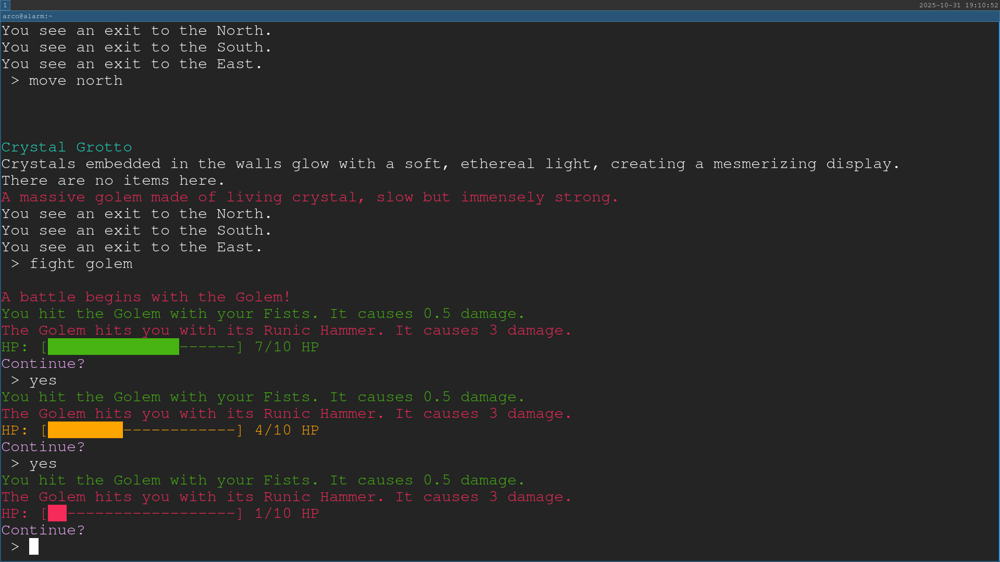

# Scripted Journeys
*2024-2025 - Aged 13-14*

## Overview
Scripted Journeys is a text-based adventure game. I originally got the idea from a programming article which made a similar one, which I then improved on. I added multiple maps, which are defined as a set of XML files so users could add new ones if they want. I also added user settings and a few new features. Finally, the hardest part about the whole project was packaging and publishing it so people can actually play it.
### Links
* **GitHub**: [https://github.com/SamBell2/ScriptedJourneys](https://github.com/SamBell2/ScriptedJourneys){rel="noopener" target="_blank"}
* **Flathub**: [https://flathub.org/en/apps/io.github.MrPiggy92.ScriptedJourneys](https://flathub.org/en/apps/io.github.MrPiggy92.ScriptedJourneys){rel="noopener" target="_blank"}
* **Windows Installer**: [Download](https://github.com/SamBell2/ScriptedJourneys/raw/refs/heads/master/windows/Output/Scripted%20Journeys.exe)
***
## How It Works
The first thing it does when you open the game is it checks if you have already played it. If this is the first time you play it, it will give you an introduction and the option to change some settings. It then opens the main screen. Once you have chosen a map from the main screen, it launches the actual game.
***
## Main Screen
This is a simple loop, getting input then using a large if-elif-else block to process it. It supports a few different functions:  

* **Listing available maps**: It just uses `os.listdir()` with the map folder and filters the output.
* **Changing settings**: It gets user settings from a JSON file, then lets the user select which setting to change and what to change it to, before writing it back to the file.
* **Loading a saved game**: It has a single save file, which it loads and decodes using `pickle`. It is a Python list of the Map object then the Player object. Each of these contain references to the other required objects. Once these are decoded, it starts playing using this current state.
* **Quitting**: It simply raises a `SystemExit()` to close the game. It is terminal-based and all files are closed as soon as they have been written to or read from, so it doesn't need to worry about closing anything special.
* **Launching the game**: The main screen doesn't need to do anything apart from run a single function. This runs the actual game, and once it is finished the function returns.
***
## Game Loop
This is similar to the main screen in that it is just a big loop, but it has a few extra tricks. This is what it does every loop:

1. It checks if you are dead.
2. It outputs a block of information, including what room you are in, where the exits are, the items in the room and what enemies you can fight.
3. It gets your command.
4. It parses and runs your command:  
    1. It uses a large dictionary that relates the command with the function that runs it and the number of arguments the function takes.
    2. It uses fuzzy matching to find which command you meant to type. This means it doesn't matter if you have a typo. It uses a Levenshtein Distance algorithm to work out how many alterations are needed to convert your command into a possible command, and uses the result.
    3. It retrieves the correct details about your command from the dictionary.
    4. It runs the function with the map and the player as arguments, as well as the second word of the command if the function wants it.
5. If there is a `RuntimeError` (which I am using as a quit signal) then it breaks out of the loop. I should probably create a separate exception instead of `RuntimeError` but so far it hasn't been necessary.
***
## Publishing
Once I had got the game to a playable state, I decided to publish it online. First, I put it on [Flathub](https://flathub.org){rel="noopener" target="_blank"} because I use Linux on my computer, and Flathub is one of the main app stores. Once I had done that, I kept developing it for a while, before I decided to make it work on Windows. I still want to make it work on macOS, but in order to publish apps for Apple, you have to have a Mac and I don't.
### Flathub
This was the most challenging part of the project. First, I had to make the app set itself up when you first run it, then I had to make a manifest file. This defined all of the dependencies my app needed, the metadata, where the code was and how to put all the bits of the app in the right places. I then had to test it a lot because I got half of it wrong the first time. Next, I had to submit a pull request to a GitHub repository which added my manifest and code to a new branch. It got rejected a few times, but I eventually discovered that it was because I had to have the code online, not in the PR. It took me about a week to fix the sources section of the manifest to work with a GitHub source, but once I did it got accepted quickly. It is now online [here](https://flathub.org/apps/io.github.MrPiggy92.ScriptedJourneys){rel="noopener" target="_blank"}.
### Windows
The hardest part about packaging for Windows was the refactoring of a good portion of it to remove Linux-only sections, which took a good few weeks. I then had to check that I hadn't broken the Flathub elements, then I spent a while fixing those bits I did break. Once all of the code worked on both of them, I had to compile it to an executable, which contained the actual game. However, I still wasn't finished. This ran the game, but it didn't install it, so i still had to work out how to actually package it. This bit was much easier than I thought, as I found a tool called [Inno Setup](https:https://jrsoftware.org/isinfo.php){rel="noopener" target="_blank"} which did most of the work for me. I still had to configure it so it put all of the files in the right place in the EXE, but it did the hardest bits. You can grab the installer [here](https://github.com/SamBell2/ScriptedJourneys/raw/refs/heads/master/windows/Output/Scripted%20Journeys.exe).
***
## Challenges
The only real challenge in the programming part was working out how to get the game files over multiple operating systems, but it wasn't too hard. The hardest part was publishing it to Flathub, because I had to make the manifest and then go through the long and complicated process of getting my app accepted by the maintainers.
***
## What I Learnt
* ANSI color codes in terminal output
* Data and settings storage for apps
* Python compilation and packaging
* Cross-platform distribution (Windows & Linux)
* Creating Windows installers
* Publishing apps on Flathub