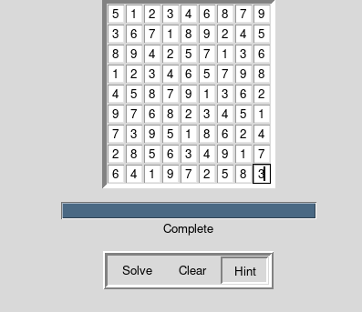

# Sudoku Solver
*2023 - Aged 12*

## Overview
This was my first project related to computer intelligence: it uses a recursive backtracking algorithm to test every possible solution, rejecting wrong answers as early as possible. You can give it a partial 9x9 sudoku puzzle and it will solve it for you. I learnt a lot about how recursion can be used to solve search-based problems.
***
## Features
* Solves 9x9 sudoku puzzles
* Checks for impossible sudoku
* GUI for easy use
* Gives hints to the next square
***
## Backtracking Algorithm
The solver uses a recursive backtracking algorithm to find the solution. The program begins at the first empty square, setting it to 1. It then checks if the puzzle is impossible (i.e. the same number is found twice in a single row, column or 3x3 box). If the puzzle is possible, the solver then calls itself to solve this new puzzle. If, however, the new puzzle is not possible, it changes the 1 to a 2 and checks again. This repeats until either it finds a possible number or gets to 9. If it gets to a 9, then some previous square is wrong, so it blanks the square out and returns to the solver above it. The solver above it now knows that the numbers it has are not possible, so it adds 1 to the last number and tries again. This whole recursive process keeps going until either the whole puzzle is complete, or it has tried every combination and none of them work. If this is the case, it reports an unsolvable sudoku.
***
## The Possibility Checker
This loops over each square of the puzzle, where it checks if it is empty. If not, if it is in the set of numbers in this row, then it says it is impossible (the same number cannot occur twice in the same row). If it is not in the set, then it is added to the set. It then does the same with columns, and then blocks.
***
## The GUI
I used Tkinter to make the GUI as it is quite simple. First, I made a `Frame` containing 81 `Entry`s in a grid layout. The variables holding these Entries were held in a 2D array mirroring the puzzle. I also added a `Progressbar`and 3 `Button`s in another `Frame`. When you press the Clear button, it empties the entire sudoku. When you press the Hint button, it solves the entire puzzle and tells you the next number. When you press Solve, it solves the puzzle, keeping track of the number of iterations and recursions done, then runs the progress bar for a few seconds (it is relative to the number of steps done) before telling you the result. I didn't need the progress bar, and the entire puzzle is done before the progress bar even starts, but I added it to learn more about GUI elements.
***
## The Code
You can see the full implementation below, including the solver, validity checking and the GUI.
<details>
<summary style="cursor: pointer">Show/Hide Code</summary>
```python
#!/usr/bin/env python3

##  IMPORTS  ##

import tkinter as tk
from tkinter import ttk
from tkinter.messagebox import showinfo

##  VARIABLES  ##

count = 0

##  METHODS  ##

def board_to_list(board):
    entryboard = [[] for _ in range(9)]
    for row in range(9):
        for item in range(9):
            try:
                if (board[row][item].get() == ""):
                    entryboard[row].append(-1)
                elif not(int(board[row][item].get()) in range(1,10)):
                    raise ValueError
                else:
                    entryboard[row].append(int(board[row][item].get()))
            except:
                showinfo(message="Invalid sudoku")
                return False
    return entryboard

def find_next_empty(puzzle):
    for row in range(9):
        for column in range(9):
            if puzzle[row][column] == -1:
                return row, column
    return None, None

def is_valid(puzzle, guess, row, col):
    row_vals = puzzle[row]
    if guess in row_vals:
        return False
    col_vals = [puzzle[i][col] for i in range(9)]
    if guess in col_vals:
        return False
    row_start = (row // 3) * 3
    col_start = (col // 3) * 3
    for r in range(row_start, row_start + 3):
        for c in range(col_start, col_start + 3):
            if puzzle[r][c] == guess:
                return False
    return True
    
def solve_sudoku(puzzle):
    global count
    row, col = find_next_empty(puzzle)
    if row is None and col is None:
        return True
    for guess in range(1,10):
        count += 1
        if is_valid(puzzle, guess, row, col):
            puzzle[row][col] = guess
            if solve_sudoku(puzzle):
                return True
        puzzle[row][col] = -1
    return False

def is_possible(puzzle):
    for i in range(9):
        row = {}
        column = {}
        block = {}
        row_cube = 3 * (i//3)
        column_cube = 3 * (i%3)
        for j in range(9):
            if puzzle[i][j] != -1 and puzzle[i][j] in row:
                return False
            row[puzzle[i][j]] = 1
            print(row)
            if puzzle[j][i] != -1 and puzzle[j][i] in column:
                return False
            column[puzzle[j][i]] = 1
            rc= row_cube + j // 3
            cc = column_cube + j % 3
            if puzzle[rc][cc] in block and puzzle[rc][cc] != -1:
                return False
            block[puzzle[rc][cc]] = 1
    return True

def handle_solve_click(event, board, pb):
    global count
    count = 0
    entryboard = board_to_list(board)
    if not entryboard:
        return
    if not(is_possible(entryboard)):
        showinfo(message="Invalid sudoku")
        return False
    solve_sudoku(entryboard)
    time = count / 5
    while time > 10000:
        time -= 1000
        print(time)
    pb.start(round(time/100))
    window.after(round(time), lambda: show_solution(entryboard, board, pb))
    window.after(10, update_progress_bar)

def show_solution(entryboard, board, pb):
    global count
    count = 0
    for row in range(9):
        for item in range(9):
            board[row][item].delete(0, tk.END)
            board[row][item].insert(0, entryboard[row][item])
    print("+" + "---+"*9)
    for i, row in enumerate(entryboard):
        print(("|" + " {}   {}   {} |"*3).format(*[x if x != -1 else " " for x in row]))
        if i % 3 == 2:
            print("+" + "---+"*9)
        else:
            print("+" + "   +"*9)
    pb.stop()
    pb['value'] = 100

def handle_clear_click(event, board, pb, progress):
    for row in range(9):
        for item in range(9):
            board[row][item].delete(0, tk.END)
    pb['value'] = 0
    progress['text'] = "0.0%"

def handle_hint_click(event, board):
    entryboard = board_to_list(board)
    otherboard = board_to_list(board)
    if not(entryboard):
        return False
    if not(is_possible(entryboard)):
        showinfo(message="possible")
        return False
    solve_sudoku(entryboard)
    for row in range(9):
        for item in range(9):
            if otherboard[row][item] != entryboard[row][item]:
                board[row][item].delete(0, tk.END)
                board[row][item].insert(0, entryboard[row][item])
                return True
    showinfo(message="Already solved")
    
def update_progress_bar():
    if pb['value'] < 100:
        progress['text'] =  f"{pb['value']}%"
        window.after(10, update_progress_bar)
    else:
        pb['value'] = 100
        progress['text'] = "Complete"

##  MAIN LOOP  ##

if __name__ == "__main__":
    window = tk.Tk()
    board = [[] for _ in range(9)]
    sudoku_frame = tk.Frame(relief=tk.SUNKEN, borderwidth=5)
    for row in range(9):
        for item in range(9):
            myentry = tk.Entry(master=sudoku_frame, width=2, justify='center')
            myentry.grid(row=row, column=item)
            board[row].append(myentry)
    sudoku_frame.pack()
    progress_frame = tk.Frame()
    pb = ttk.Progressbar(master=progress_frame, orient='horizontal', mode='determinate', length=280)
    pb.grid(row=0, column=0)
    progress = tk.Label(master=progress_frame, text="0.0%")
    progress.grid(row=1, column=0)
    progress_frame.pack(pady=15)
    button_frame = tk.Frame(relief=tk.RIDGE, borderwidth=5)
    solve_btn = tk.Button(master=button_frame, text="Solve", relief=tk.FLAT, borderwidth=2)
    solve_btn.bind("<Button-1>", lambda event: handle_solve_click(event, board, pb))
    solve_btn.grid(row=0,column=0)
    clear_btn = tk.Button(master=button_frame, text="Clear", relief=tk.FLAT, borderwidth=2)
    clear_btn.bind("<Button-1>", lambda event: handle_clear_click(event, board, pb, progress))
    clear_btn.grid(row=0, column=1)
    hint_btn = tk.Button(master=button_frame, text="Hint", relief=tk.FLAT, borderwidth=2)
    hint_btn.bind("<Button-1>", lambda event: handle_hint_click(event, board))
    hint_btn.grid(row=0, column=3)
    button_frame.pack()
    window.mainloop()
```
</details>
***
## Challenges
The most challenging part of the whole process was actually checking if a solution was impossible. This was mostly because the 3x3 blocks were really hard to check through neatly, without hardcoding a check for each square. If I come back to this project in the future, I will probably remove the progress bar and instead update the grid as it is solved, showing the user exactly how it works. However, this would mean either making the solver directly access frontend code, or restructuring it to yield intermediate states.
***
## What I Learned
* How recursive backtracking works to explore every option
* How to reject invalid solutions early
* How to separate backend logic from frontend displays
* How to make simple GUIs