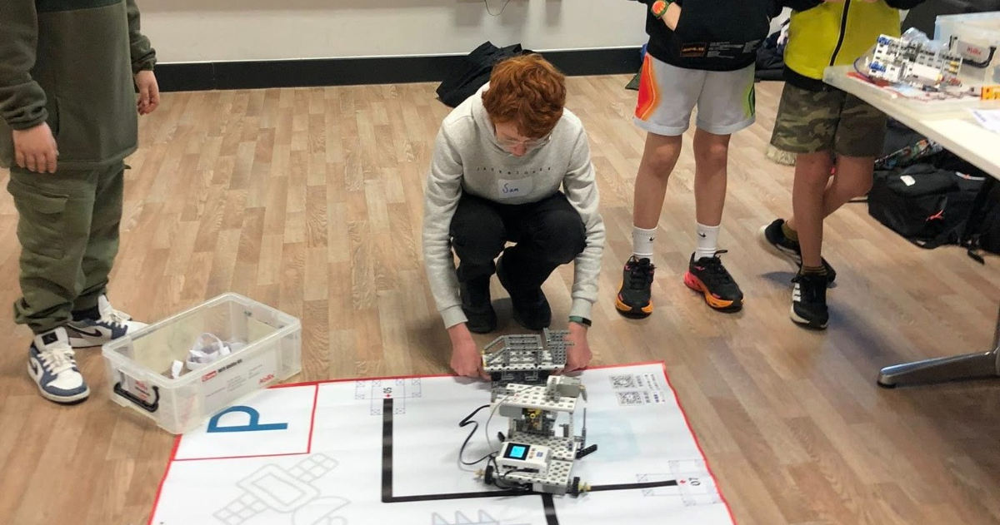

# World Educational Robotics 2025
*2025*

*Me testing my robot on one of the tasks*
## Overview
[WER](http://wergame.org/){target="_blank" rel="noopener"} is an international educational robotics curriculum. There are many countries that host WER extra-curricular clubs with millions of participants, and some countries host robotics competitions. The most regular competitions take place in Britain every July and the winners from that competition qualify for the world championships in December in Shanghai. It is a large event, with over 6000 contestants in the championships. I joined in late December last year, and I went to the competition in England. I came 4th in my age category, but the top 3 all came from China to compete, so I qualified as the top British contestant and am going to the world championships!
## About the competition
Each year, the competition has a different theme and map. This year was autonomous driving, and had pre-set tasks relating to the theme, e.g. Replacing the batteries in a model electric car and picking up containers to transport. You must compete in teams of 1 - 3. You get given a basic robot (plastic plate, 2 motors with wheels, 5 line sensors and a controller) and must build additional things to complete the required tasks. It uses Abilix robots which have a meccano-style construction. You must also program the robot using either a version of Scratch or Python to move around the map and complete the required tasks.
<!--## My Progress
The first things I did when I started were build the basic robot, just so I knew how it fit together, then I tried to get it to move. I quite quickly (due to my previous programming experience) worked out how to do things and moved onto trying to do it in C (this was with old robots that only took binaries). Over a few hours of programming at home, I got the robot to reliably move to all of the positions and return. Over the next few weeks, I began to engineer solutions to some of the tasks, and I eventually got them working. I then learnt that in the actual competition, you only have *3 minutes* to complete all of the tasks, so speed is very important. I decided to mount all of my solutions on separate plates that I can switch between in seconds. Then I went to the competition, found the 2 new tasks that we don't know about until we get there, and managed to complete 1 of them! Since then, I have solved the 4th task model (changing batteries in a model car) and have massively sped up the robot.
## My Code
I have approximately 300 lines of Python code, which I can't post yet as other contestants may be able to take it and use some of it, but I will upload it shortly after the world championships.
## Challenges-->
## Saturday Classes
I go to a club every Saturday for an hour and a half. This is where I do most of my progress, testing, and learning. Here I get to use one of the club's robots. Before I went to the competition, about half of these sessions were learning things such as calibration curves and how to line up neatly with the tasks, and the other half were just preparing for the competition. Now I'm going to China, I need all the time I can get to train and prepare.

*I am being presented my award*
## British Competition
When I got to the competiton, I saw where the tasks were on the map and what the 2 new tasks were. I had 2 hours to get the robot to do all of the pre-set tasks in their locations and engineer solutions to the new tasks. Then we had a 3-minute judging session, lunch, and in the afternoon all of the tasks had been moved around. We had another 2 hours to prepare the robots and code for the new positions, then a 3 minute judging and the awards ceremony.
## Home programing
As well as preparing my code at the Saturday classes, I also do some at home. The main bit that I did was a few months ago where I wrote all of the code to get to all of the positions and back in a single week, then on Saturday I tested it and most of it worked or almost worked first time! It only took me about 2 hours of debugging to get all of it working. I have also done other programming and preparing at home, sych as thinking of a few different methods for task 4. Ultimately, none of those methods are actually being used, as I saw some other really good designs at the competition which I have taken inspiration from.
## Challenges
Doing this had a lot of challenges, from my first sessions building the robot, starting to program it, learning how to use C++ with the robot, etc. One of the biggest (unexpected) challenges was when they completely changed the syntax of the function calls *3 weeks* before the competition! I had to spend a lot of time at home converting my 300 lines of code. Shortly after the competition, they changed from the old C202 robots to the new SK201 robots. This meant that I had to change all of my code from C++ to Python. However, the functions were very similar so it didn't take too long. The most challenging task model was task 4, because one of the batteries was too low for a motor to reach, so I had to use a crank linkage to move it. Also, you had to put a battery back in the low position so the claw had to be able to grab and release.